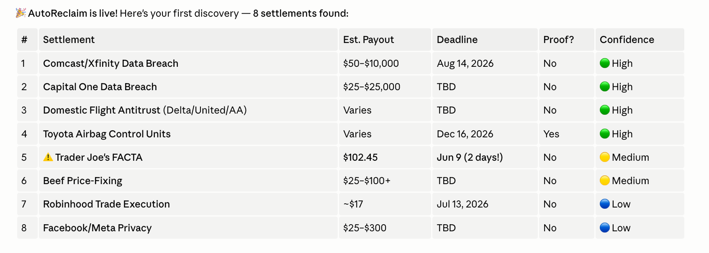

# AutoReclaim

**Every year, billions of dollars in US class-action settlements go unclaimed — because nobody knows the settlement exists, or the claim form isn't worth 20 minutes of their evening. AutoReclaim closes that gap for you, and you never have to write a line of code or fill out a form.**

You just talk to it:

> *"Find the class-action settlements I qualify for."*
> *"File the ones you found."*
> *"Submit the Equifax claim."*

It runs weekly, finds settlements you likely qualify for, pre-fills the claim forms, and stops for your OK before submitting anything. Your sensitive details stay encrypted on your own machine.



> **Status: alpha / building in public.** The core loop works end-to-end, but this is early. Expect rough edges. Issues and PRs welcome.

[](LICENSE)


---

## No code, no servers

AutoReclaim is more than a set of commands you run by hand. It installs itself as [Claude Code](https://claude.com/claude-code) skills **and sets up its own weekly schedule for you** — so after a one-time onboarding (a guided chat), it runs on its own and you only ever talk to it in plain English. You never touch a terminal again.

And it runs on infrastructure you already have. The weekly discovery executes as a **scheduled Claude Code job** — a local task, or a cloud routine that runs even with your Mac off — drawing on the **spare weekly capacity of your existing Claude subscription**. No servers to deploy, no separate API key, no extra bill. If you're already paying for Claude Code, the cron is effectively free.

## What it does

1. **Discovers** — each week it reads the major settlement trackers and, using an agent (not brittle keyword matching), judges *semantically* whether you might qualify, based on a lightweight profile of brands/services you use.
2. **Finds hard evidence** — it checks (via the free [XposedOrNot](https://xposedornot.com/) API, no key, no scraping) which data-breach settlements your email is *actually* implicated in, and flags those as high-confidence.
3. **Pre-fills, never auto-submits** — for each match it opens the real claim form and fills it with your locally-stored details, then **stops before submit**. You review and confirm every single claim.

## The two guarantees

AutoReclaim is built around two hard rules baked into the agent's instructions, not bolted on:

- **Honesty.** It only surfaces settlements you plausibly qualify for, never invents eligibility, and never submits a claim without your explicit confirmation. You are always the one attesting.
- **Privacy.** Your name, address, and phone number are encrypted on your machine (key in your OS keychain) and **never committed to any repo.** By default you enter them directly on your device, so they never pass through the AI or any server. If you'd rather, you can opt in to letting the assistant record them for you — it warns you clearly first that this routes your details through the AI during setup. Either way, the code and your data live in separate places.

## How it's wired

AutoReclaim splits into three planes so the sharable code never touches your secrets:

| Plane | Lives where | Holds |
|-------|-------------|-------|
| **Code** | this public repo | the agent logic, skills, pipeline |
| **Data** | a separate *private* `autoreclaim-data` repo | your category profile + the queue of found settlements |
| **PII** | `pii.enc`, local only, never pushed | name / address / phone, encrypted at rest |

Two run modes:
- **Local-only** — discovery, matching, and filing all run on your Mac. Nothing leaves the machine.
- **Cloud discovery + local filing** — a scheduled cloud routine does the weekly discovery and emails you a digest (runs even with your Mac off); filing still happens locally with your encrypted PII.

See [ARCHITECTURE.md](ARCHITECTURE.md) for the full picture.

## Getting started

The only manual step is cloning the repo. Everything after that — environment, profile, encrypting your details, scheduling — happens by talking to Claude Code.

<details>
<summary><b>One-time setup</b></summary>

```bash
git clone https://github.com/zxhderifish/autoreclaim.git
cd autoreclaim
```

Then open Claude Code in that folder and say **"set me up"** (or run the `/autoreclaim-onboard` skill). It walks you through everything by chat: it creates the Python environment, builds your profile, helps you encrypt your PII **locally** (the values never enter the conversation), lets you pick a run mode, schedules the weekly job, and runs a first discovery so you see real results immediately.

</details>

From then on, just tell it what you want:

> *"Check this week's settlements."* · *"File the ones you found."* · *"Submit the GEICO one."*

<details>
<summary><b>Running the tests (contributors)</b></summary>

```bash
python3 -m venv .venv && .venv/bin/pip install -e '.[dev]'
.venv/bin/pytest
```

</details>

## Disclaimer

AutoReclaim helps you *find* settlements and *prepare* claims. **You are solely responsible for the accuracy and truthfulness of any claim you submit.** Class-action claim forms are legal attestations — only submit claims you genuinely qualify for. AutoReclaim never submits on your behalf without your explicit, per-claim confirmation, and it is not legal or financial advice.

## License

[MIT](LICENSE) © 2026 zxhderifish
